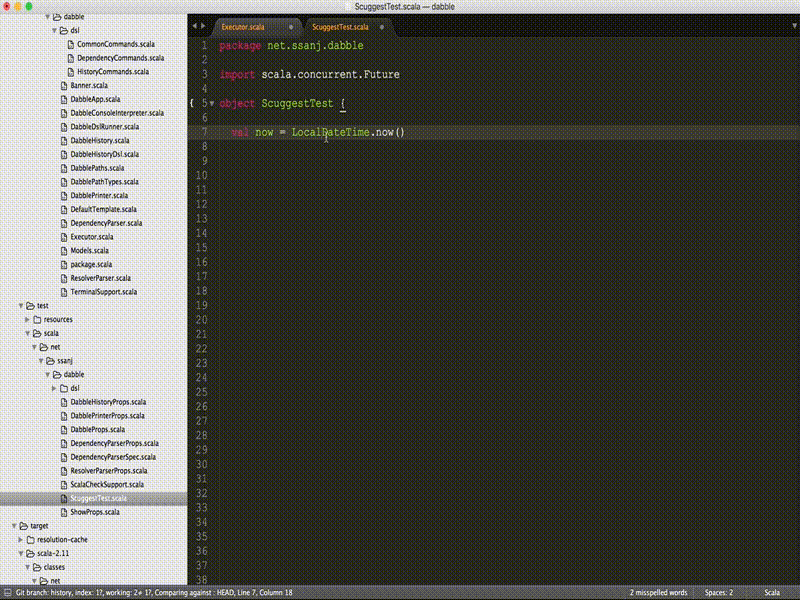
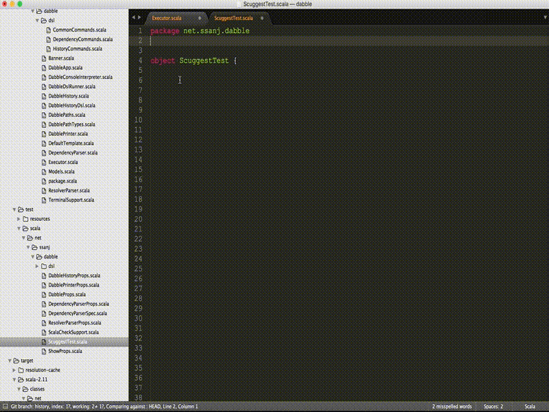
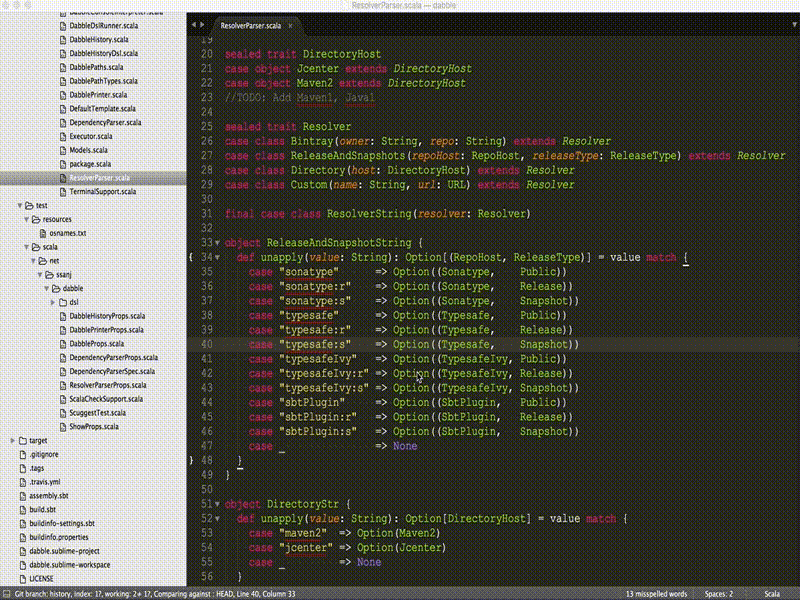

[](https://travis-ci.org/ssanj/Scuggest)

Scuggest
========

Scuggest (pronounced 'Suggest') is a Sublime Text plugin for automatically adding imports to your Scala files. It resolves the imports by scanning through a provided list of jars and class directories.

Scuggest was initially based on [JavaImports](https://github.com/MDeiml/SublimeJavaImports) but now works in a completely different way.

Installation
------------

Here are a few ways to install Scuggest on your system.

1. Install it directly through [Package Control](https://packagecontrol.io/packages/Scuggest).

2. Git clone the Scuggest repository into your Packages directory:

    ```git clone git@github.com:ssanj/Scuggest.git```

3. Download the [latest release](https://github.com/ssanj/Scuggest/releases) source code and extract it to the Packages directory.

> The Packages directory is located at:

> * OS X: ~/Library/Application Support/Sublime Text 3/Packages
> * Linux: ~/.config/sublime-text-3/Packages
> * Windows: %APPDATA%\Sublime Text 3\Packages

Configuration
--------------

### Using SBT

Run [sbt-scuggest](https://github.com/ssanj/sbt-scuggest) to generate all your basic configuration and update (or generate) your project file.

### Manually

To use Scuggest, you need to have a project file (.sublime-project) created for your Scala project. You can do this for an existing project by clicking on the __Project__ > __Save Project As ...__ menu item and saving the project to the root of your Scala project directory (usually where your build.sbt file lives).

Once you have a project created, use the settings element below and customise the __scuggest_import_path__ and __scuggest_filtered_path__ to suite your needs.

```javascript
"settings": {
        "scuggest_import_path":
        [
            "/Library/Java/JavaVirtualMachines/jdk1.8.0_65.jdk/Contents/Home/jre/lib/rt.jar",
            "/Users/sanj/.ivy2/cache/org.scala-lang/scala-library/jars/scala-library-2.11.8.jar",
            "/Volumes/Work/projects/code/scala/toy/dabble/target/scala-2.11/classes",
            "/Users/sanj/.ivy2/cache/com.lihaoyi/ammonite-ops_2.11/jars/ammonite-ops_2.11-0.5.7.jar",
            "/Users/sanj/.ivy2/cache/com.github.scopt/scopt_2.11/jars/scopt_2.11-3.4.0.jar",
            "/Users/sanj/.ivy2/cache/org.scalaz/scalaz-core_2.11/jars/scalaz-core_2.11-7.2.2.jar"
        ],
        "scuggest_filtered_path":
        [
            "com/sun",
            "sun",
            "javax/swing",
            "org/omg",
            "com/apple",
            "java/awt"
        ]
}
```

__scuggest_import_path__ lists the jar files you want Scuggest to look for classes in. This can include either Java or Scala jar files. Some typical jars to include are the Java rt.jar file and the scala-library-scala-version.jar file. You can add as many or as few libraries that you want searched here.

__scuggest_filtered_path__ lists the path prefixes that are skipped when scanning for a target class. A typical example could be anything under the com/sun package. Notice that these are file paths as opposed to package (or dotted) paths.

Usage
-----

You can use Scuggest in the following ways:

1. Click on the name of a class that you want to import into your Scala source file and press __CMD + ALT + I__. This will select the word under the cursor and attempt to display any matched classes.



2. If you press __CMD + ALT + I__ on an empty line then a search box will be displayed allowing you to enter the class name or a wildcard to match on.



3. If you press __SHIFT+CMD + ALT + I__ anywhere, even within a selection, a search box will be displayed allowing you to enter the class name or a wildcard to match on.



Selection Matchers
------------------

Scuggest uses a variety of matching strategies to find the class you select.

### 1. Class name ###

This is the first matcher that is tried against a selection. It attempts to find classes that _end with_ the search term supplied.
__NB__ _A selection is converted to a search term. The actual matching is done against the search terms_.

```
# example class: net.ssanj.dabble.ResolverParser
# search term: ResolverParser
# matched: true
```

```
# example class: net.ssanj.dabble.DabbleWorkPath
# search term: ResolverParser
# matched: false
```

```
# example class: net.ssanj.dabble.ResolverParser
# search term: ResolverPars
# matched: false
```

### 2. Object name ###

This is similar to the __Class name__ matcher but only matches objects that _end with_ the search term. Object class names end with a _$_.

```
# example: net.ssanj.dabble.DabblePathTypes$DabbleWorkPath$
# search term: DabbleWorkPath
# match: true
```

### 3. Object with subtype(s) ###

Matches a search term against an object that defines other types (classes, traits or other objects)

```
# example: net.ssanj.dabble.DabblePathTypes.DabbleWorkPath.NestedDabbleWorkPath.MoreNestedDabbleWorkPath
# search term: DabbleWorkPath
# matches:
#  net.ssanj.dabble.DabblePathTypes.DabbleWorkPath
#  net.ssanj.dabble.DabblePathTypes.DabbleWorkPath.NestedDabbleWorkPath
#  net.ssanj.dabble.DabblePathTypes.DabbleWorkPath.NestedDabbleWorkPath.MoreNestedDabbleWorkPath
#  net.ssanj.dabble.DabblePathTypes.DabbleWorkPath._
```

Wildcard Matches
----------------

These matchers are generally used through a search box.

### 1. By prefix

Matches a class name that starts with the given search term. The search term should end with an __*__.

```
# search term: Future*
# matches:
#   java.util.concurrent.Future
#   java.util.concurrent.FutureTask
#   scala.concurrent.Future
#   scala.concurrent.FutureTaskRunner
```

### 2. By suffix

Matches a class name that ends with the given search term. The search term should end with an __*__.

```
# search *DateTime
# matches:
#  java.time.LocalDateTime
#  java.time.OffsetDateTime
#  java.time.ZonedDateTime
#  java.time.chrono.ChroLocalDateTime
#  java.time.chrono.ChroZonedDateTime
#  java.util.Formatter.DateTime
```

### 3. Anywhere

Matches the supplied search term anywhere in the class name. The search term should begin and end with an __*__.

```
# search: *Work*
# matches:
#  java.util.concurrent.ForkJoinWorkerThread
#  java.util.concurrent.ForkJoinPool.WorkQueue
#  java.util.concurrent.ForkJoinPool.InnocuousForkJoinWorkerThreadFactory
#  java.util.concurrent.ForkJoinPool.ForkJoinWorkerThreadFactory
#  java.util.concurrent.ForkJoinPool.DefaultForkJoinWorkerThreadFactory

```

Caching
-------

Scuggest tries to cache your files in the most non-intrusive way possible. The contents of any jar files specified in the __scuggest_import_path__ is cached until the __scuggest_import_path__ is modified by adding, deleting or modifying a jar path. Directory paths specified in __scuggest_import_path__ are always read each time in order to index any new files that could be added.

You can display the cache by running the "Scuggest: Show Cache" command from the command palette (__CMD + P__). This outputs the project location along with the number of classes cached for that project to the console (__CTRL + `__).
```
Scuggest cache:
/Volumes/Work/projects/code/scala/toy/dabble/dabble.sublime-project : 9992
```

You can also clear the full cache for all projects by running the "Scuggest: Clear Cache" command from the command palette. This will mean that the cache will have to be recreated on the next import call.